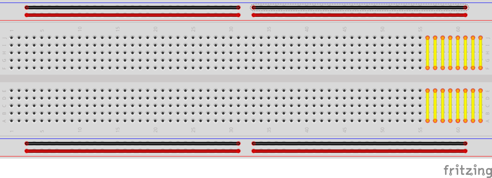
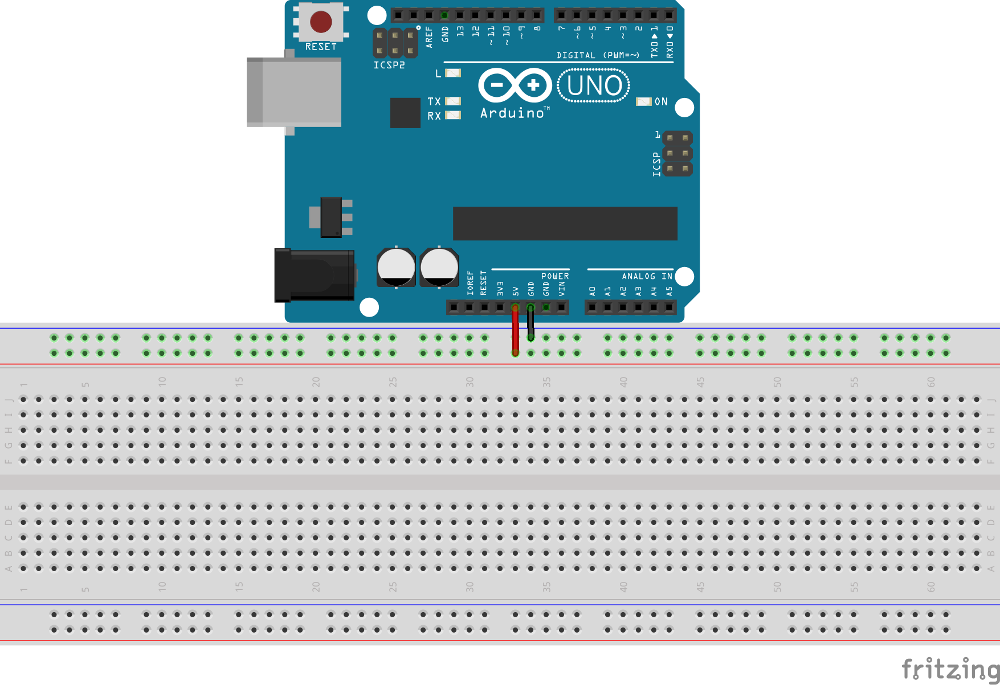

---
author: Raphael Kopala, Shawn Nock
institute: Unlondon Digital Media Assoc.
title: Introduction to Arduino
subtitle: Maker Workshop
lang: en-CA
colorlinks: true
...

## Goals

By the end of this class, you'll:

 - Know how to create programs for Arduino and run them.
 - Have learned about digital input and output, reading switches and
   lighting LEDs
 - Have created a *Whack-a-Mole* type game.
 - Be prepared to follow Arduino tutorials online and continue
   exploring.

## Unlondon

\begin{center}
{\huge Enabling Exploration, Creativity, and Excellence In Art+Make+Tech}
\end{center}

Challenging and embracing ideas related to new technologies and social
platforms through the education, entertainment and engagement of our
membership and the community-at-large.

- 121Studios: Coworking for Creatives
- Unlab: Hackerspace
- Events: STEAM Outreach & Edu., ExplodeConf, Nuit Blanche

## Shawn: Day Job

Freelance Embedded Systems Engineer

- Indoor location tracking w/ Bluetooth
- Keychain / Fitness Band Widgets
- Joystick for VR
- Remote Controls
- Internet of S*#t

## Shawn: The Fun Stuff

Hacker, Church of the Weird Machine, Odd Duck

\begin{columns}[c]
\column{0.50\textwidth}

\begin{itemize}
\item Arduino compatible implant
\item EEG Games / Toy Hacking
\item Brain Stimulation
\item Be Weird, Make Weird, Have Fun!
\end{itemize}

\column{0.50\textwidth}
\begin{center}
\includegraphics[width=0.95\textwidth]{images/timbo.jpg}
\vspace{5mm}
\includegraphics[width=0.95\textwidth]{images/circadia.jpg}
\end{center}
\end{columns}

## Raphael: Day Job

Mechanical Engineer 

 - Working in the medical device industry 
 - Experience in medical device R&D and Manufacturing 
 - Teaching SolidWorks CAD at Fanshawe

## Raphael: The Fun Stuff

Thinker, Jack of all Trades - Master of None

\begin{columns}[c]
\column{0.50\textwidth}
\begin{itemize}
 \item Arduino for Fun, and Odd Jobs 
 \item 3D Printer Hobbyist 
 \item PC Builder \& Gamer 
 \item Fish keeper
\end{itemize}
\column{0.50\textwidth}
\begin{center}
\includegraphics[width=0.80\textwidth]{images/rapha1.png}
\vspace{5mm}
\includegraphics[width=0.80\textwidth]{images/rapha2.png}
\end{center}
\end{columns}

# What's in your kit?

## Kit Contents

- Arduino Uno R3
- Solderless Breadboard
- Connecting wires
- LEDs
- Resistors, Potentiometer
- Buzzer

## What is Arduino?

\begin{center}
\includegraphics[width=0.75\textwidth]{images/arduino-overview.jpg}
\end{center}

It's a kit (on a board) with the bare minimum components to easily use the $\mu$C
hardware. They do the basic, boring design needed for any board, so users only
need to add the neat stuff.

## Arduino Software

The Arduino folks also adapted an *Integrated Development Environment*
(IDE) to their boards. This IDE allows us to easily write programs for
their boards and then write the programs to the $\mu$C.

\Large Get the Arduino IDE:
[https://www.arduino.cc/en/Main/Software](https://www.arduino.cc/en/Main/Software)

<!-- ## Installation  -->

<!-- \Large Get installing -->

# Circuit Basics

## Current

Current is the flow of charge through a circuit. Measured in Amperes
(\si{\ampere}).

## Resistance / Impedance

Circuits have a resistance to current flow that depends on the parts
in the circuit. 

Measured in Ohms (\si{\ohm})

## Voltage

Voltage is a potential (akin to a pressure) pushing the current
through a circuit. Current is said to flow from higher (+) voltage
to lower (-) voltage.

Measured in Volts (\si{\volt})
 
## Ohm's Law; Light

Voltage, Current and Resistance are related to each other.

- As voltage increases, current increases
- As voltage decreases, current decreases
- As resistance increases, current decreases
- As resistance decreases, current increases

## \si{\volt},  \si{\ohm}, \si{\ampere}: The Water Analogy

If charge were water, then:

  - resistance = obstacles blocking flow
  - current = flow rate
  - voltage = change in height *or* pressure.

## Diode

\begin{columns}[c]
\column{0.50\textwidth}

\begin{itemize}
\item One way value for current\footnotemark[1]
\item LED $\equiv$ Light Emitting Diode
\item Band marks (-)\footnotemark[2]
\item Longer leg marks (+)
\end{itemize}

\column{0.50\textwidth}
\begin{center}
\includegraphics[width=0.75\textwidth]{images/diode.png}
\vspace{5mm}
\includegraphics[width=0.50\textwidth]{images/led.jpg}
\end{center}
\end{columns}

\footnotetext[1]{\tiny \url{https://learn.sparkfun.com/tutorials/diodes}}
\footnotetext[2]{\tiny \url{https://learn.sparkfun.com/tutorials/polarity/diode-and-led-polarity}}

## Diode Problems

* Diodes don't limit current
* Diodes aren't perfect (some current turned to heat)
* Too much current $\rightarrow$ Too much heat $\rightarrow$ \
  \
  \center{ \huge{\emph{What's that smell?} } }

## Resistor

\begin{columns}[c]
\column{0.50\textwidth}

\begin{itemize}
\item \emph{Resists}/limits the flow of current
\item Needed for LEDs: $\approx\SI{1000}{\ohm}$\\
\item Button Pull-up/down: $\ge\SI{10}{\kilo\ohm}$
\item Color coded, Google it
\end{itemize}
\column{0.50\textwidth}

\includegraphics[width=0.98\textwidth]{images/resistor.png}

\end{columns}

## Buttons

- Buttons connect _or_ disconnect two wires/parts
- Momentary Switch: Normally Closed (NC), Normally Open (NO)
- Toggle Switch

## Circuits

A circuit is a completed loop from HIGH potential (voltage) to LOW,
which causes current to flow through some other components along the
way.

## Transducers {.fragile}

Often these *other* components are *transducers*, which convert
electrical energy into another sort of energy:

| |
-------|--------:
Speaker|Electrical $\rightarrow$ Sound
Microphone|Sound $\rightarrow$ Electrical
LED|Electrical $\rightarrow$ Light
LED|Light $\rightarrow$ Electrical
Piezoelectric|Electrical $\rightarrow$ Motion

<!-- ## Piezo Buzzer -->

<!-- - Piezoelectric elements change shape when voltage is applied -->
<!-- - Thin discs can be made to oscillate and create sound. -->
<!-- - Contains oscillator circuit -->
<!-- - Two connections: Vcc, GND -->
<!-- - Use a switch; connected = annoying tone, disconnected = glorious silence -->

## Power

The power supply provides the energy to drive the system.

Can be a:

* Voltage Regulator (converts one potential to another)
* Batteries
* Solar Panel

In our circuits, your laptop is converting it's power source to $\SI{5}{\volt}$ and
delivering power to our circuit via USB.

## $\mu$Controller

Microcontroller ($\mu$C) is a *processor*, *memory* and a few *peripherals* on a standalone
chip.

Processor 
:    is a group of transistors that understands a dozen or so
commands (ADD, SUB, JUMP..)

Memory
:    a circuit that can hold values.

Peripherals
:    Vary chip to chip, but often include timers, communications and
ADC, DAC.

Seems complicated, but really simple. They read a command from the
start of memory, then execute the command. At the end of the command,
read the next command from the next memory cell and
repeat^[some commands change the address of the next fetched command]

## Digital Signals

- Vcc: The power supply of the circuit elements
- GND: The reference voltage (usually \SI{0}{\volt})
- Connecting a part to Vcc = Logical 1 or High
- Connecting to GND = Logical 0 or Low
- Connecting various pins to Vcc or Ground is all the $\mu$C can do to
  talk to the world [^4]

[^4]: w/o fancy peripherals or dirty tricks

## $\mu$Controller INPUT and OUTPUT

Most of the pins on the Arduino can be set for INPUT or OUTPUT mode.

- INPUT mode pins listen for a signal ($0$ or $1$) from another device
- OUTPUT mode pins drive the pin High or Low

## Floating Pins

What's happens if an INPUT mode pin tries to read the value of a pin
that is connected to nothing? Is that a $1$ or $0$?

\center{\huge {No one knows!}}

It's dependant of transient charges, static, nearby electric fields,
the phase of the moon, \ldots Whenever you want to check a digital
signal, make sure that something is *driving* it (ensuring Vcc or GND).

## $\mu$C + Digital Signals as Switches

If one end of an LED is connected to ground, and the other end is
connected to an OUTPUT pin on a $\mu$Controller, then:

- If the $\mu$C sets the pin High (Vcc, $\SI{5}{\volt}$) then current
will flow from the pin through the LED and turn it on.
- If $\mu$C sets the pin Low (GND, $\SI{0}{\volt}$) then the current
will not flow and the LED is off.

# Let's start programming

## Configure Arduino

\begin{center}
\includegraphics[width=0.98\textwidth]{images/arduino-board.png}
\end{center}

* Board: Arduino/Genuino UNO
* Port: \ldots

<!-- ## Fetch the Class Code -->

<!-- - Download and extract: [https://nocko.se/assets/arduino-medway.zip](https://nocko.se/assets/arduino-medway.zip) -->
<!-- - File$\rightarrow$Preferences -->
<!-- - Browse for sketchbook -->
<!-- - Point it at the `sketchbook` subfolder of the extracted download -->
<!-- - You should now see a list of projects in the -->
<!--   File$\rightarrow$Sketchbook menu. -->

## The Code Environment

\begin{center}
\includegraphics[width=0.95\textwidth]{images/arduino-toolbar.png}
\end{center}

## Your first Program

~~~ C
#define LED 13

/* the setup function runs once on reset / power */
void setup() {
  pinMode(LED, OUTPUT);
}

/* loop() repeats until reset or power off */
void loop() {
  digitalWrite(LED, HIGH);   // turn on LED
  delay(1000);              // wait for a second
  digitalWrite(LED, LOW);    // turn the off LED
  delay(1000);
}

~~~

# Add Some Parts

## Breadboard

\ 

- Connectors gently pinch component leads, wires.
- Have internal connections

## Power Up the Rails

We use the long rows to distribute power. The Arduino outputs
$\SI{5}{\volt}$ on the pin marked `5V`, the reference (GND) is marked
`GND`.

## Buzzer & Button: Hardware

\begin{center}
\includegraphics[width=0.98\textwidth]{images/buzzer-breadboard.png}
\end{center}

## Push Button: Zoom

\begin{center}
\includegraphics[width=0.98\textwidth]{images/bb+switch+zoom.png}
\end{center}

## Pullup / Pulldown Resistors

Reading a floating pin is **bad**. A switch only connects
and disconnects a wire. When the wire is disconnected... the INPUT pin
is floating!

\vfill

**Solution:**

Connect the pin to Vcc so that it reads High; use a
resistor to prevent short circuit (limit current).

## Buzzer: Zoom

\begin{center}
\includegraphics[width=0.98\textwidth]{images/buzzer-zoom.png}
\end{center}

## Buzzer / Button: Software (Part 1)

~~~ C
#define BUTTON 2
#define BUZZER 8

int button_state;

void setup() {
  pinMode(BUTTON, INPUT);
  pinMode(BUZZER, OUTPUT);
  digitalWrite(BUZZER, LOW); /* Start w/ LED off */
}
~~~
## Programming Note: Variables

Declare a variable:

~~~ C
int button_state = HIGH;
~~~

`<type> <name> [= <initial value>];` (value optional)

It's a name, like a preprocessor `#define`, but the value can change
at *runtime*

## Programming Note: *If* Statement

~~~ C
if (condition) {
	// body: Runs if condition true ( != 0)
} else {
	// Runs if condition false ( == 0 )
}
~~~

 - body code inside curly braces: `{` `}`
 - **condition** evaluates to 0 $\rightarrow$ body code skipped
 - else section is optional, runs if **condition** evaluates to 0
 - **condition** evaluates to *not* 0 $\rightarrow$ body code runs
 
## Programming Note: `==`

In C-like languages, the `==` operator checks if two things
(statements, variables, \ldots) are equal to each other.

 - It returns `1` if the items are equal, *or*
 - It returns `0` if the items are not equal

## Programming Note: Functions

Functions make it easy to reuse code. You already know / use several
functions:

 - pinMode
 - digitalWrite
 - delay
 
digitalRead(pin number) returns HIGH or LOW depending on current state
of any **INPUT** pin.

You can write your own functions!

## Programming Note: Writing Functions

~~~ C
void my_function(int arg1, ...) {
	// Do fun things
}
~~~

void:
: Return type. Void means nothing returned. Can be any type.

my_function:
: A name for your function

arguments:
: A type and name for any parameters you want to use in your function
from the outside.

Define a function once, you can use it again and again. Better than
copy/pasting.

## Push Button: Software (Part 2)

~~~ C
void buzz(int ms) {
	digitalWrite(BUZZER, HIGH);
	delay(ms);
	digitalWrite(BUZZER, LOW);
}
void loop() {
  button_state = digitalRead(BUTTON);
  if (button_state == LOW) {
	buzz(100);
  }
}
~~~

# More Parts

## Potentiometer

*Puh - ten - she - ometer*

- *Pot* for short
- A Voltage Divider
- Voltage at *Wiper* is somewhere between potential at the two
  terminals.
- The exact wiper potential depends on the position of the knob/lever.

## ADC: Analog to Digital Converter

- A peripheral of the $\mu$Controller
- Measures Potential, outputs a number
- In our case, $\SI{0}{\volt}\rightarrow0$ and
  $\SI{5}{\volt}\rightarrow1023$
- A0-A5 pins on Arduino can be used
- Fun uses: Reading pot position, sampling audio, reading from sensors

## The Pot Hookup

\begin{center}
\includegraphics[width=0.98\textwidth]{images/bb+switch+pot.png}
\end{center}

Connect center pin to `A0`, outer pins to ($+$) and ($-$) rails

## Pot Code

`analogRead(`*pin*`)` returns the voltage at the pin (0--1023), it can
be used directly or via variable.

~~~ C
#define LED 13
void setup() {
  pinMode(LED, OUTPUT);
}
void loop() {
  digitalWrite(LED, HIGH);
  delay(analogRead(A0));
  digitalWrite(LED, LOW);
  delay(analogRead(A0));
}
~~~

Since the delay() calls use the result of analogRead (0-1023), the
blink rate changes with knob position.

# Shall we play a game?

## Hooking up a bunch of LEDs

\begin{center}
\includegraphics[width=0.65\textwidth]{images/bb+switch+pot+leds.png}
\end{center}

## LEDs, the first one

Looks complicated, but for each LED: The short leg goes to ground, the
long leg goes to one end of a resistor, and the other end of the
resistor goes to the arduino pin.

\begin{center}
\includegraphics[width=0.55\textwidth]{images/one-led.png}
\end{center}

## Programming Note: `for` Loop

~~~ C
for ( initializer ; condition; increment ) {
	// This body will repeat while condition != 0
}
~~~

initializer
: Executed once at beginning of loop. Often used to declare a local
variable.

condition
: Loop will repeat while condition is true ($\neq0$)

increment
: Runs *after* each loop. Often used to increment variables.

\center{*All fields are optional*}

## Cylon Simulator: Part. 1; Pin Setup

~~~ C
int delay_ms;
void setup() {
	pinMode(3, OUTPUT);
	pinMode(4, OUTPUT);
	pinMode(5, OUTPUT);
	pinMode(6, OUTPUT);
	pinMode(7, OUTPUT);
}
~~~

## Cylon Simulator: Part. 2

~~~ C
void loop () {
	for (int i = 4; i <= 7; i++) {
		delay_ms = analogRead(A0);
		digitalWrite(i - 1, LOW);
		digitalWrite(i, HIGH);
		delay(delay_ms);
	}
	for (int i = 6; i >= 3; i--) {
		delay_ms = analogRead(A0);
		digitalWrite(i + 1, LOW);
		digitalWrite(i, HIGH);
		delay(delay_ms);
	}
}
~~~

## Programming Note: `while` Loop

~~~ C
while ( statement ) {
	// This body will repeat while condition is true
	// True means statement != 0
}
~~~

initializer
: Executed once at beginning of loop. Often used to declare a local
variable.

condition
: Loop will repeat while condition is true ($\neq0$)

increment
: Runs *after* each loop. Often used to increment variables.

\center{*All fields are optional*}

## Winner, Winner, Chicken Dinner

~~~ C
#define WINNER 5
void check_delay(int cur_led, int delay_ms) {
  unsigned long start = millis();
  while (millis() < start+delay_ms) {
    if (digitalRead(BUTTON) == LOW) {
      if (cur_led == WINNER) {
        do_winner();
      } else {
        while (digitalRead(BUTTON) == LOW) {
          do_loser();
        }
      }
    }
  }
}
~~~

## More functions, pt. 1
~~~ C
void set_all_leds(int state) {
  for (int i = 3; i <= 7; i++) {
    digitalWrite(i, state);
  }
}

void do_loser(void) {
  buzz(500);
}
~~~

## More functions, pt. 2
~~~ C
void do_winner(void) {
  set_all_leds(HIGH);
  buzz(100);
  delay(100);
  buzz(100);
  set_all_leds(LOW);
}
~~~

## Putting it Together

~~~ C
loop () {
	for (int i = 4; i <= 7; i++) {
		delay_ms = analogRead(A0);
		digitalWrite(i - 1, LOW);
		digitalWrite(i, HIGH);
		check_delay(i, delay_ms);
	}
	for (int i = 6; i >= 3; i--) {
		...
		check_delay(i, delay_ms);
	}
}
~~~

# The End?

# Extra Credit
## Ohm's Law

Ohm's Law relates current to potential and resistance.

$$ V = IR $$
$$ I=\frac{V}{R} $$
$$ R = \frac{V}{I} $$

* V = Potential in Volts (\si{\volt})
* I = Current in Amperes (\si{\ampere})
* R = Resistance in Ohms (\si{\ohm})

## Ohm's Law: Example

The datasheet for an LED says that the maximum continuous current is
\SI{15}{\milli\ampere}. Your circuit operates at \SI{5}{\volt}\footnotemark[1]. How
big should your resistor be?

$$ \si{\ohm} = \frac{\SI{5}{\volt}}{\SI{0.015}{\ampere}} = 333.\overline{3}\si{\ohm} $$

How much current for our *cheet sheet* value?

$$ \si{\ampere} = \frac{\SI{5}{\volt}}{\SI{1}{\kilo\ohm}} = \SI{5}{\milli\ampere} $$

\footnotetext[1]{\tiny Actually, this calculation is inaccurate. LEDs
will have a *forward voltage drop* of between \SI{1.8}{\volt} and
\SI{3.3}{\volt} this should be subtracted from \si{\volt} above... but
it's not critical.}

## Current Limits, Arduino

- No single pin should source more that \SI{20}{\milli\ampere} (\SI{40}{\milli\ampere} is absolute max)
- Pins are ganged together in groups of 8, no group should source more
  than \SI{150}{\milli\ampere} total
- The whole board cannot source more than \SI{200}{\milli\ampere} total
  
Practically speaking, this means that the Arduino cannot drive
speakers, most motors, or anything normally mains powered.

## So\ldots no Arduino smart blender?

You can control almost anything with an arduino, you just can't power
it with the Arduino. There are various devices that let you switch
highier powered devices:

 - Transistors
 - Relays
 - Solid State Relays
 - Triac
 
## HIGHs and LOWs

Many different logic levels are in common use: \SI{1.2}{\volt},
\SI{1.8}{\volt}, \SI{2.5}{\volt}, \SI{3.3}{\volt}, and
\SI{5}{\volt}. The voltage cited is the *nominal* Vcc of the system.

A HIGH signal is generally any voltage $\geq \frac{2}{3}V_{cc}$.

A LOW signal is generally any voltage $\leq \frac{1}{3}V_{cc}$.

## HIGHs and LOWs, pt. 2

In your travels, you're likely to see both \SI{5}{\volt} and
\SI{3.3}{\volt} sensors and peripherals.

Since $\SI{3.3}{\volt}\geq\frac{2}{3}V_cc$ your Arduino will accept
input from a \SI{3.3}{\volt} peripheral without issue.

If you drive an output to \SI{5}{\volt} while it's connected to a
\SI{3.3}{\volt} peripheral with an Arduino **it will blow up your
peripheral**.^[In the datasheet for the sensor, it'll have a
section called *Absolute Maximums*. Generally \SI{3.3}{\volt} parts
won't accept more that $\approx\SI{3.6}{\volt}$, but some will.]

## HIGHs and LOWs, pt. 3

Solutions:

 - Level Shifter: A dedicated chip that translates between
   voltages. Available as uni or bidirectional.
   
 - Buy a 3.3V Arduino Compatible. Arduinos are available that operate
   at the lower voltage.
